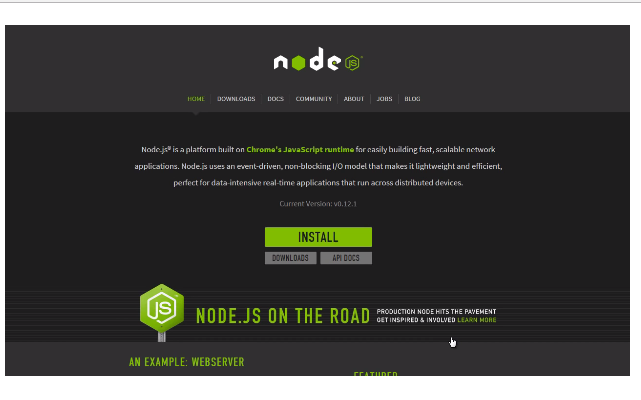
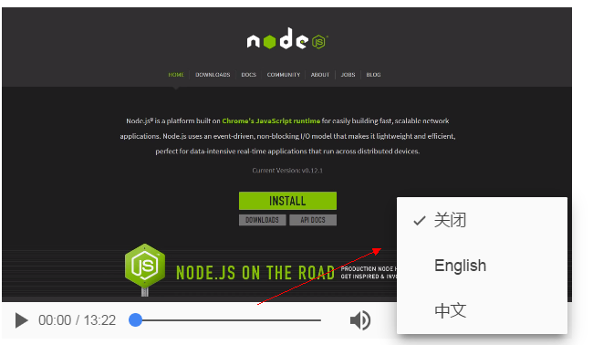

#一、video标签

##1.0 video 音频标签（多媒体标签）

在网站里面，我们经常会看见一些视频元素！如图：

如上图一样！那是怎么做的呢？早在H5之前是利用flash插件制作的，由于一些历史原因！那种做法已经在慢慢的淘汰了！今天我们将会学习一门新的技术来制作它！

那就是H5里面的video标签！
写法如下：

	<video src=""></video>

单纯的这样写！你在页面里，是什么也看不到的！需要为其指定资源路径！

###1.1 src 资源路径属性

	<video src="./test.mp4" width="500" height="300"></video>	

将视频资源的路径放到src后面的引号里面。这里我为了限制video大小 所以多写了width和height属性！
看看页面效果！

###1.2 autoplay 自动播放属性

相信大家也发了问题！资源是加载进来了，但是不能播放！此时，我们再加上autoplay属性就可以解决了！

	<video src="./test.mp4" width="500" height="300" autoplay></video>

大家自行添加后再次刷新看看！完美解决！

###1.3 controls 控件属性

视频是可以完美的播放了，但是问题也来了，如何停止呢？面对这样的问题！其实HTML5的制定者们已经帮我们想好了解决办法！那就是添加 controls 属性

	<video src="./test.mp4" width="500" height="300" controls autoplay></video>	

到这里最基本video最基本的操作就算结束了！

下面再来几个锦上添花的属性！

###1.4 loop 循环播放

如果我们想对某个视频进行循环播放的话！

	<video src="./test.mp4" width="500" height="300" controls autoplay loop></video>

标签内部添加loop属性就可以了！

###1.5 muted 静音属性

如果页面一旦加载就进行播放，可能会有点吵闹。我们可以设置静音播放

	<video src="./test.mp4" width="500" height="300" controls autoplay muted></video>

###1.6 preload 预加载属性

在某些情况下面，我们可能需要页面的视频资源进行预加载！但是不让其自动播放！这个时候，你就会用到preload属性

	<video src="./test.mp4" width="500" height="300" controls proload></video>

###1.7 poster

在网络不是很好的情况下面，如果视频资源得不到及时的响应，那么在video标签处 会显示一片空白！很显然这是不可取的！为了解决这个办法！

	<video src="./test.mp4" width="500" height="300" controls poster="./placeholder.png"></video>

我们会使用poster为其添加一张图片放到前面，这样的话，可以避免空白样式！

学会了以上的标签属性，才是刚开始！接下来我们去研究一下性能分析及兼容处理！

##2.0 浅谈video性能与兼容

###2.1 preload属性

相信前面的学习，大家已经对其有了一定的了解，是用来预加载的
视频资源！虽然它很有用！但是他会占用一定的网络资源！

但是在以下的场景内：慎用

- 用户观看可能不大的视频，不要写
- 为视障人群的页面不要写

preload: 有三个属性值：

- auto（默认值）： 不写preload与书写 preload="auto"属性值一样的！ 进行预加载
- none：  阻止资源加载！
- metadata: 载入视频的第一帧！

请问： poster和metadata你能说出什么区别吗？

**警告：** 某些浏览器会因为支持属性的差别。会导致不能识别metadata属性值。这样话就会导致浏览器还是会请求*整个*的视频资源！所以，请尽量使用poster属性！

###2.2 资源属性
在1.1的时候我们知道了src属性可以指定视频源的位置，方便我们的播放！

但是一个很不幸的事情要告诉大家！浏览器对视频的格式支持有着差别！

| 格式 | 说明 | 支持 |
| ------| ------ | ------ |
| WebM | 无专利 免版税 | Opera Chrome Firefox |
| Ogg/Theora | 同上 | Oprea Chrome Firefox |
| MP4/H.264 | 免费到2015年 之后是部分免费 | IE Chrome Safari |

所以一个src是不同满足需求的！所以我们需要利用到source元素

	<video width="500" height="300" controls ">
		<source src="./test.webm">
		<source src="./test.ogv">
		<source src="./test.mp4">
	</video>

如果单纯的这样书写的话！浏览器会按照列表的顺序，挨个向服务器发送请求！这样会产生额外的信息！为了解决这个问题！我们要用到type属性！

	<video width="500" height="300" controls track="hello">
		<source src="./test.webm" type="video/webm">
		<source src="./test.ogv" type="video/ogv">
		<source src="./test.mp4" type="video/mp4">
	</video>

浏览器会根据服务器返回的MIME类型 在客户进行比对！告诉浏览器播放哪个文件。减少资源的浪费！

##3.0番外篇： track

track跟踪的意思，在浏览器里面用来追踪字幕的！先来看看其用法！

	<video width="500" height="300" controls track="hello">
		<source src="./test.webm" type="video/webm">
		<source src="./test.ogv" type="video/ogv">
		<source src="./test.mp4" type="video/mp4">
		<track src="subtitles_en.vtt" kind="subtitles" srclang="en" label="English">
		<track src="subtitles_no.vtt" kind="subtitles" srclang="no"label="中文">
	</video>
	
需要有vtt文件的，也就是字幕文件！看看展示效果！

目前track属性的支持效果最差，在IE10 Chrome23 Opera12 Safari6才开始支持这个元素！

还有就是大部分视频 MV都自带字幕，所以此属性仅作为了解即可！

有条件的同学可以去youtube上面体验一把！

#二、 audio

在页面中我们已经能有添加视频控件了！我们接下来学习使用添加audio标签。

	<audio controls autoplay>
		<source src="./fade.ogg">
		<source src="./fade.mp3">
		<source src="./fade.wav">
	</audio>

显示效果如下：

由于audio标签的属性与video标签的属性极其类似！所以我们就不再这里赘述了！简单讲讲他们的区别！

- 音频播放控件支持效果比较好 所以不需要写type类型！
- track和poster在audio里面几乎用不到！

切记！ 

使用audio标签的时候，最好把controls写上。否则的话，你若只是写了autoplay属性，那样的话，用户们将无法关闭音乐！这个一个非常差劲的做法！对用户不友好！